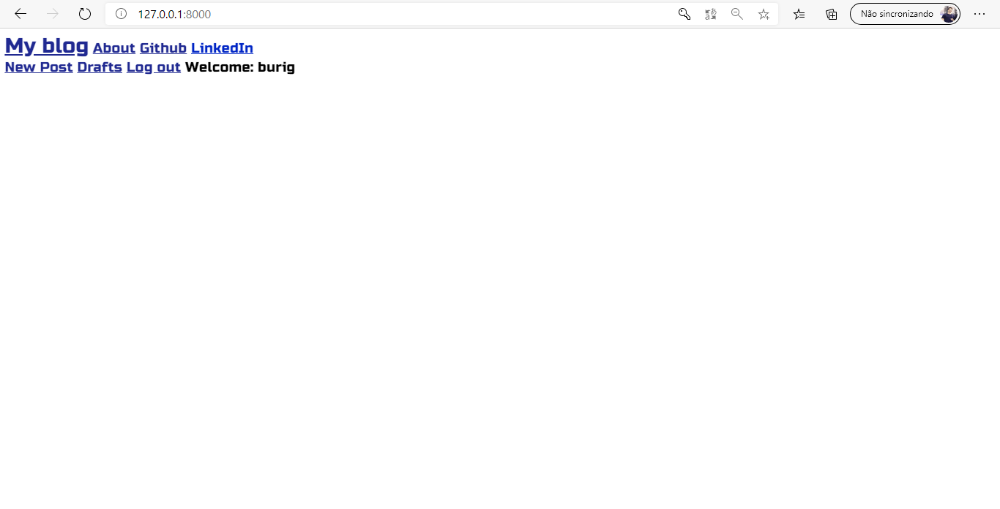
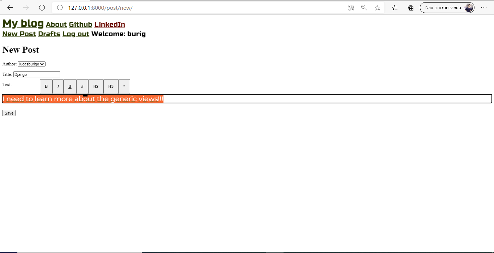
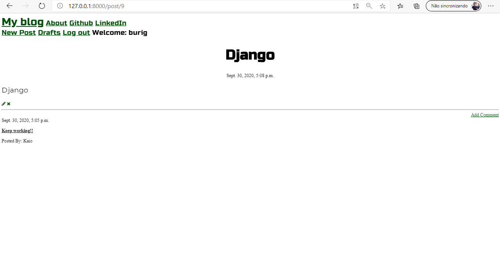
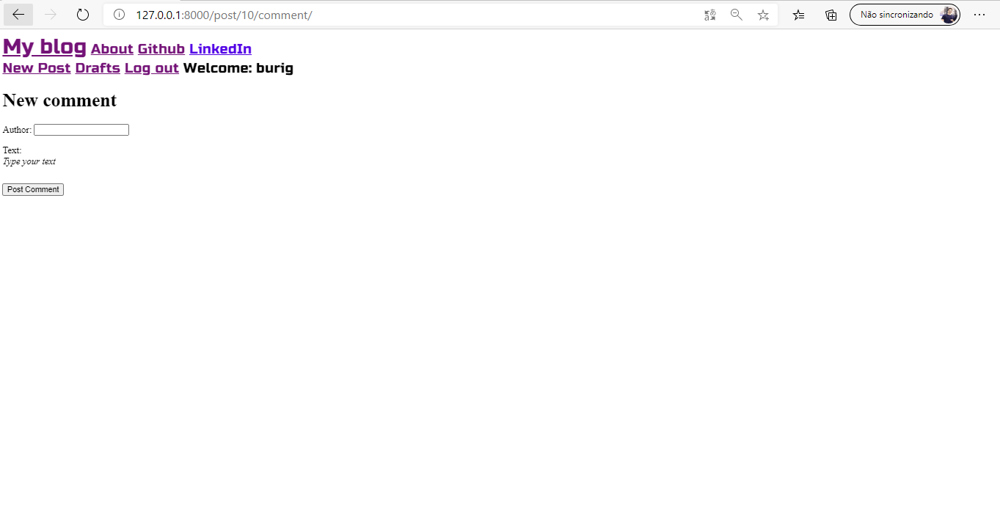
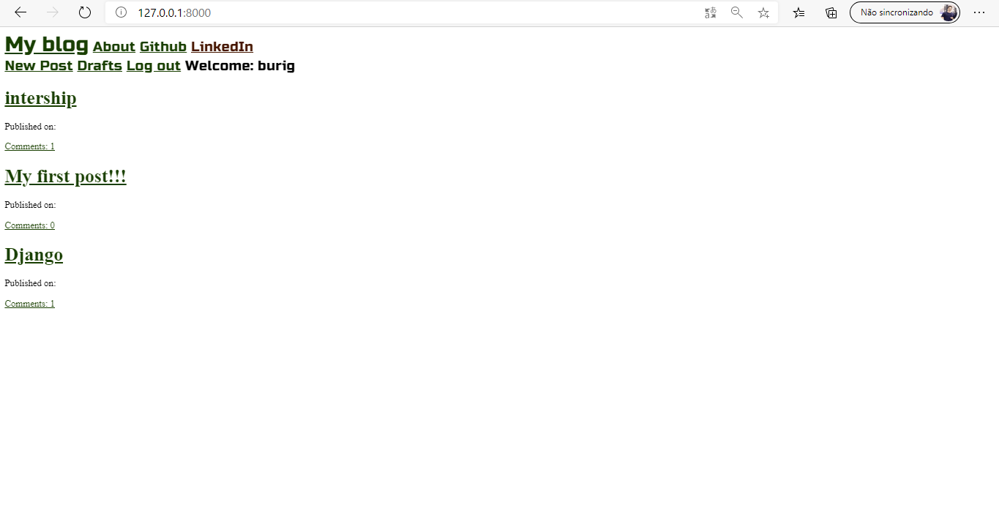

# Blog
## This repository have a project of a blog site!
It´s a commun blog site, where we can find some basics stuffs like: Posts, comments and text editors.

Below, you will see all functionalities of this program

1. **Base Page** 

Below, the image shows the base page, when you can find link to github and linkedin, and marked with a red line an icon, when you can click to login. \
:exclamation: You need to be a superuser to login!!!

2. **Login**

Here is the login page, with a form to fill

3. **page for user only**

Here, a new page open just for superusers after login. \ 
:heavy_exclamation_mark: Only superusers can write and publish a post or a comment

4. **New Post**

By clicking in "New Post", a new page will open, with a form to fill. \
:heavy_exclamation_mark: in the text field, when you select your text, few customize options will open.

5. **Save Post**

After create the Post, you can do three things:
  * delete it by clicking in the :x: icon
  * Update it by clicking in the :pencil2: icon
  * comment it by clicking in the Add Comment link :link:
  

  
6. **Comment**

By clicking in the Add Comment link, a new page with a comment form will open.

7. **List of Post**

By clicking in the "My Blog", you can find a page with all the posts

:interrobang: ***This project, have only the basics, but is very important to know how use Generic Views, and others functionalities on Django. I hope to help you*** :relaxed:

