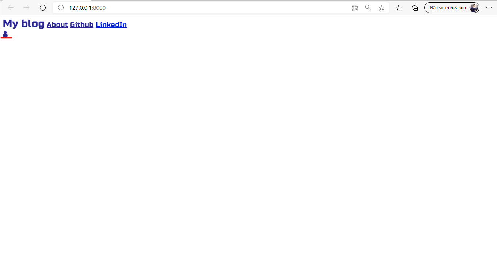
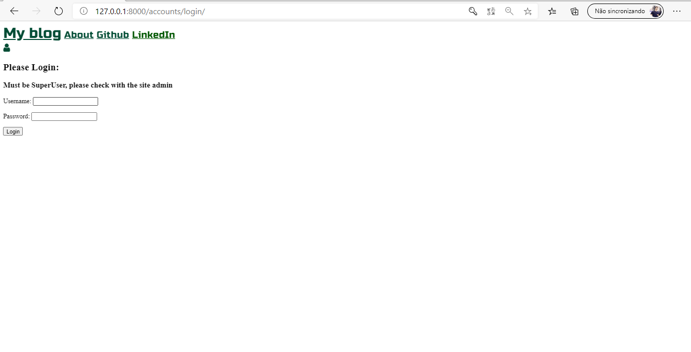

# Blog
## This repository have a project of a blog site!
It´s a commun blog site, where we can find some basics stuffs like: Posts, comments and text editors.

Below, you will see all functionalities of this program

1. **Base Page** 

Below, the image shows the base page, when you can find link to github and linkedin, and marked with a red line an icon, when you can click to login. \
:exclamation: You need to be a superuser to login!!!

2. **Login**

Here is the login page, with a form to fill

